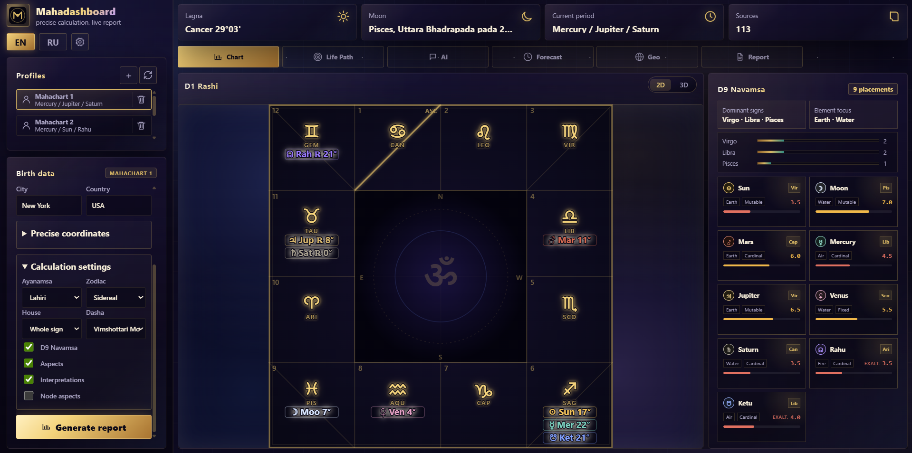
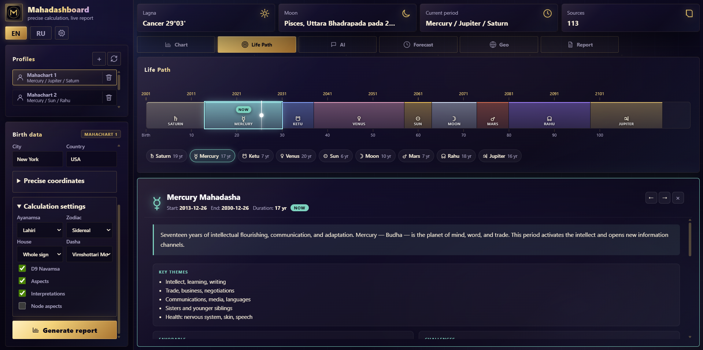
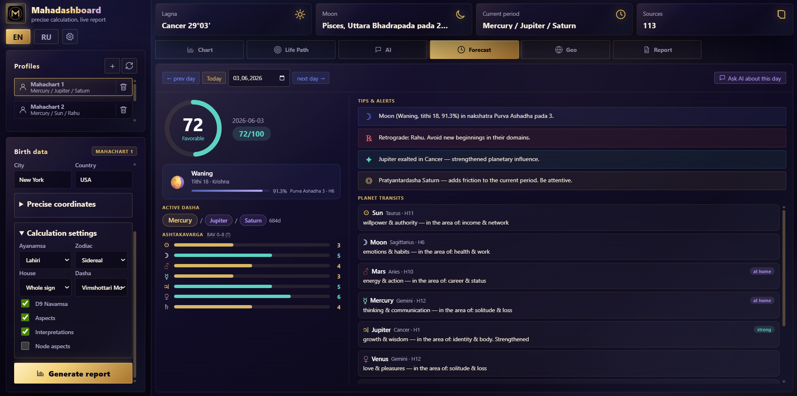
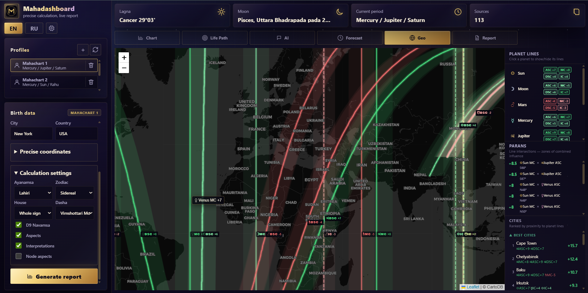
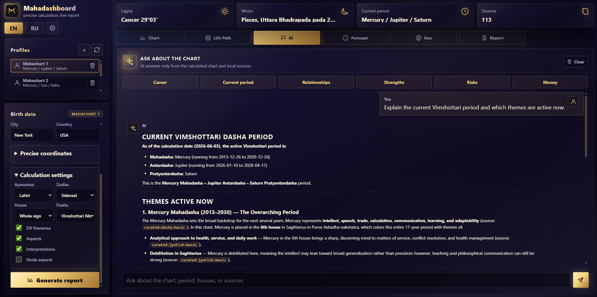
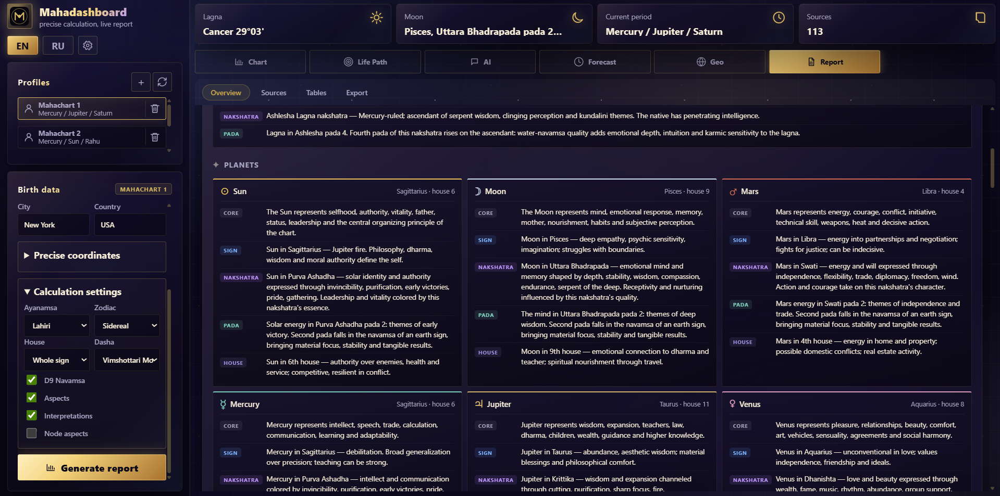

# Mahadashboard

A local Vedic astrology (Jyotish) workstation. Enter a birth date, time, and place — get a precise chart, planetary period timeline, daily forecast, curated interpretations, and an AI assistant. Everything runs on your machine; no cloud subscription required.


---

## Before you start — install two tools

You need **Node.js** and **Python** installed on your computer. Both are free.

### 1. Install Node.js

Go to **[nodejs.org/en/download](https://nodejs.org/en/download/)** and download the installer for your system (choose the **LTS** version). Run it and click through — default options are fine.

> To check it worked, open a terminal and type `node --version`. You should see something like `v20.x.x`.

### 2. Install Python

Go to **[python.org/downloads](https://www.python.org/downloads/)** and download the latest installer.

**Windows users:** on the first screen of the installer, check the box **"Add Python to PATH"** before clicking Install. This is important.

> To check it worked, open a terminal and type `python --version`. You should see `Python 3.x.x`.

---

## Installation

Open a terminal in the folder where you want to keep the project, then run:

```bash
git clone https://github.com/wadadawadada/Mahadashboard.git
cd Mahadashboard
npm install
```

`npm install` will automatically install both Node.js and Python dependencies. You should see `Python dependencies installed successfully.` at the end.

---

## Running

```bash
npm start
```

The app opens at **http://localhost:7860** automatically in your browser.

---

## First-time setup — AI chat (optional)

The AI chat tab requires a free API key from OpenRouter. Chart calculations work without it.

1. Get a free key at **[openrouter.ai/keys](https://openrouter.ai/keys)**
2. Click the ⚙ gear icon in the top-left of the app
3. Paste your key and choose a model (e.g. `openai/gpt-4o-mini` — free on OpenRouter)

---

## Features

### Chart — Birth Chart & Harmonic Chart



The main chart view shows two wheels side by side. On the left — the **D1 birth chart** with all nine planets placed in their signs and houses; toggle between a flat **2D** wheel and an interactive **3D** globe. On the right — the **D9 Navamsa** (a finer harmonic chart that divides each sign into 9 parts, used to read the deeper quality of planets — especially for relationships and long-term potential). Click any planet to open a panel with its sign, lunar mansion, dignity, and curated interpretation snippets.

---

### Life Path — Planetary Period Timeline



Vedic astrology divides your life into successive **planetary periods** (called *dashas*), each ruled by one of the nine planets and lasting a fixed number of years. The total cycle is 120 years. This tab shows the full sequence as a scrollable horizontal timeline with the current period highlighted.

Click any period card to expand it: you'll see the ruling planet, exact start and end dates, duration, the active **sub-period** (a shorter cycle nested inside the main one), and a full interpretation of what themes and energies that planet tends to bring.

---

### Forecast — Daily Transit Score



Pick any date and get a snapshot of that day. The circular **score ring** (0–100) summarises how the planets moving in the sky right now interact with your birth chart — higher is more favourable.

Below the score: the **active planetary period**, the **Moon's** current sign and lunar mansion (the Moon changes sign every ~2.5 days and strongly colours the mood of the day), and an **Ashtakavarga** bar chart — a classical Vedic point system (0–8 per planet) that shows how well each planet's current position supports your chart. Bars above 5 are generally good; below 3 means more friction.

On the right: **Tips & Alerts** highlight the most important events of the day, followed by a table of all **planet positions** with their house placements and the life themes they activate. Navigate with the ← → arrows or jump to any date. The "Ask AI about this day" button sends the full forecast to the AI tab for a deeper conversation.

---

### Geo — Astrocartography



A world map that shows where each planet was most powerful at the moment of your birth. The curved lines crossing the globe are **planet lines** — places on Earth where a given planet was rising, at the highest point in the sky, setting, or directly below the horizon. Living or travelling near a planet's line tends to amplify that planet's themes in your life.

Toggle individual planets on and off in the legend. The sidebar lists **parans** (points where two planet lines cross — zones of compounded influence) and a **city ranking** sorted by proximity to the strongest lines. Useful for relocation or travel questions.

---

### AI — Chart Assistant



Ask any question about the calculated chart in plain English (or Russian). The assistant answers strictly from the computed chart data and the curated interpretation library — it never invents placements or makes things up. Quick-tap **prompt chips** (Career, Current period, Relationships, Strengths, Risks, Money) to start with one click. All answers reference source keys so every claim is traceable. Conversation history is saved per profile.

---

### Report — Sources, Tables & Export



A structured document view of the full chart. The **Overview** section shows a narrative report assembled from the curated snippet library. **Sources** lists every interpretation entry that was matched (and flags any gaps). **Tables** display all planets, houses, and aspects in clean grids. The **Export** section lets you download a single Markdown file with the complete chart data, all interpretations, and the full planetary period timeline — ready to paste into any AI assistant for a deep-dive conversation.

---

## Glossary

Not familiar with Vedic astrology terms? Here's the short version:

| Term | What it means in plain language |
|---|---|
| **Jyotish** | The Sanskrit name for Vedic astrology — the system used in this app |
| **Sidereal zodiac** | The zodiac based on the actual position of stars, not the seasons. Signs are shifted ~23° from the Western (tropical) zodiac, so your Vedic sign may differ from your Western one |
| **Lagna (Ascendant)** | The zodiac sign rising on the eastern horizon at the exact moment of birth. It defines the "1st house" and is the anchor of the whole chart |
| **D1 / Rashi chart** | The main birth chart — planets placed in the 12 signs as seen from Earth at birth |
| **D9 / Navamsa** | A harmonic chart derived by dividing each sign into 9 equal parts. Shows the deeper quality of planets, especially relevant for relationships and life purpose |
| **House** | One of 12 divisions of the chart, each representing a life area (1st = self, 2nd = money, 7th = relationships, 10th = career, etc.) |
| **Nakshatra** | The Moon's position expressed as one of 27 lunar mansions (~13.3° each). Each nakshatra has a distinct mythology and set of qualities. Think of it as a finer zodiac for the Moon |
| **Dasha / Mahadasha** | A major planetary period — a span of years (6 to 20) ruled by one planet, during which that planet's themes dominate your life. The 9 planets cycle through in a fixed order totalling 120 years |
| **Antardasha** | A sub-period nested inside the mahadasha — a shorter cycle (months to a few years) co-ruled by a second planet |
| **Vimshottari** | The most widely used dasha system (used here by default). It assigns fixed period lengths to each planet based on the Moon's nakshatra at birth |
| **Ayanamsa** | The correction angle (~23°) applied to convert Western (tropical) planetary positions to the Vedic (sidereal) system. Lahiri ayanamsa is the most common standard |
| **Ashtakavarga (BAV)** | A classical point system (0–8 per planet per house) that measures how much support a planet gets when transiting a given house. 5+ = favourable, 3 or below = more challenging |
| **Transit** | A planet's current position in the sky, interpreted in relation to your birth chart |
| **Astrocartography** | A technique that projects where each birth-chart planet was on the horizon or meridian at every location on Earth. Moving to a planet's line amplifies its themes |
| **Paran** | A point on the map where two planet lines cross — a zone where both planets' themes are active simultaneously |

---

## Troubleshooting

**`npm install` says Python was not found**
→ Make sure Python is installed and "Add Python to PATH" was checked during installation. Close and reopen your terminal, then try again.

**`npm start` says Python dependencies are not installed**
→ Run `npm install` again.

**`pyswisseph` install fails on Windows**
→ Run `python -m pip install --upgrade pip` first. If it still fails, install [Microsoft C++ Build Tools](https://visualstudio.microsoft.com/visual-cpp-build-tools/).

**Blank chart after generation**
→ Open the browser console (F12). If you see a 500 error, check the terminal for the Python traceback.

**AI chat returns nothing**
→ Confirm your OpenRouter API key is set and has credits. You can update the key any time via the ⚙ gear icon.

---

## Tech stack

| Layer | Technology |
|---|---|
| Frontend | Vanilla JS, CSS custom properties |
| 3D chart | [Three.js](https://threejs.org/) |
| Map | [Leaflet](https://leafletjs.com/) |
| Server | Node.js (built-in `http`, no framework) |
| Ephemeris | [pyswisseph](https://github.com/astrorigin/pyswisseph) (Swiss Ephemeris) |
| AI | [OpenRouter](https://openrouter.ai/) |

---

## License

MIT — see [LICENSE](LICENSE).
